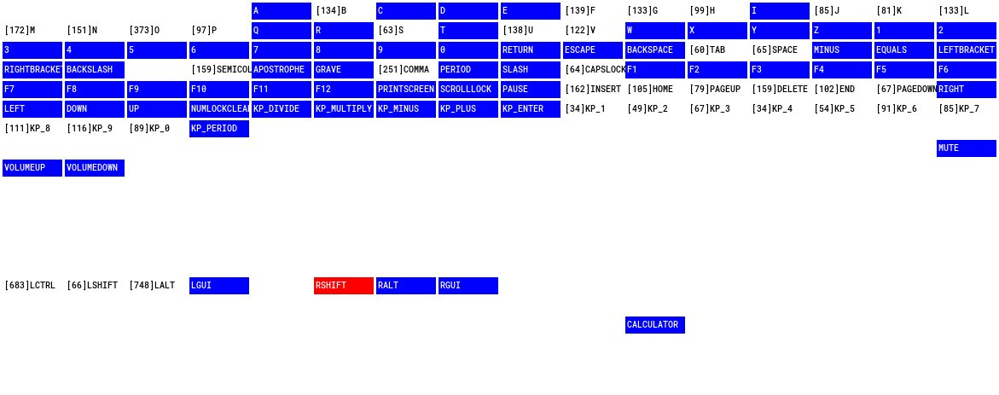

# keyboard-tester, for linux & macOS

Written so I could test macbook keyboards before sending back to clients after a board repair or similar service.

Works on keyboard scancodes, not keycodes, so will work with all keyboards but you'll be left with varying levels of keys that aren't "pressed".

#### ALPHA LEVEL DEVELOPMENT --- DON'T COMPLAIN ABOUT ANYTHING, ELSE I'LL LIKELY BITE

### Prerequisites

Requires SDL2 and SDL2_ttf

linux
```
apt install libsdl2-dev
```

macOS
```
brew install libsdl2 libsd2_ttf
```

### Build
```make```

### Parameters
```
keyboard-tester [--dl <lower bound ms>] [--dh <upper bound ms>] [-m <mapfile>] [-c]

--dl <time (20 ms default)> : Set acceptable lower limit of key down time
--dh <time (200 ms default)> : Set acceptable upper limit of key down time
-m <mapfile> : Set keyboard map to use, limits keys and sets names to test
-c : Close tester when all keys have been pressed

        ALT-Q: exit/quit
        ALT-M: Save current pressed keyset to mapfile
```

### Application Controls
```
	alt-q / opt-q : quit
	alt-m / opt-m : Save currently pressed keys array to map file
```

### Screenshots

